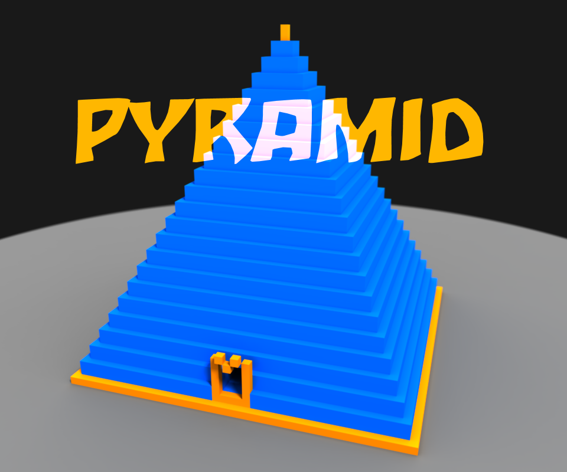

# Pyramid 
# [Jouez sur votre navigateur](http://www.bazia.net:1326/ "http://www.bazia.net:1326/")

- [Présentation orale](./presentation_pyramid.pdf "Le pdf de la présentation orale")

Pyramid est un de plateforme 3D multijoueur en ligne.
L'objectif est de réaliser des parcours le plus rapidement possible. 

Réalisé en HTML5/Javascript/WebGL (from scratch)

[Une vidéo](https://www.youtube.com/watch?v=XQ-hyYrXqfk "Vidéo youtube") d'un mod du jeu Counter-Strike dont on s'inspire.

